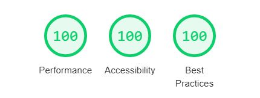

this repository

1. hosts my developer portfolio: https://snuup.github.io
2. holds a **10-line long static site generator** that embraces typescript and jsx.

github pages are configured to host the `/docs` folder.
instead of separate branches for github pages and sources, everything is in main, even the "binaries" like bundle.js so that curious visitors do not need to clone + npm install 92MB of node_modules (deeeeeenooo!!!) + run to see build results.


# 1. portfolio page

i repeatedly write web sites that are

- quasi static = no db, updated now and then
- basic html elements for text and images
- photo gallery to show photos in good size

there are excellent libraries for galleries, i belive the best one is photoswipe but there are many other good ones. i wondered however, how far it goes with plain css and minimal js so i can handle these projects without dependencies that often just do not yet use latest browser features.

i used this project to study

- the limits of a vanilla implementation (pure css as holy grail) for a gallery
- webfonts in more detail
- column layout
- layout with a raster determined by a monospace font
- image hosting services

### vanilla photo gallery

#### css scroll-snap
first i tried with a recent addition to css: [scroll-snap](https://developer.mozilla.org/en-US/docs/Web/CSS/CSS_Scroll_Snap) allows a pure css implementation of galleries, carousels and alike. one of the coolest advents in css.
Even basic keyboard navigation works with arrow keys. The animation between scrolls can be controlled with scroll-behavior:
we can have an animation determined by the browser (smooth) or no (auto) animation.

\+ pure css<br/>
\+ basic keyboard navigation<br/>
\+ animation possible with behavior:smooth<br/>
\- animation cannot be fine tuned, speed, curve<br/>
\- often will add more keyboard shortcuts which requires js anyway<br/>

#### handcrafted scrolling container
the alternative is to create an absolut positioned overflowing gallery-container and control its movement with
javascript, assigning a left value and a transition on that left poperty. This gives us full control over the animation.
This is simple and easy, but we miss the scrollbar, which i wanted ot have here. more serious,
scroll-snap gives us swiping on touch screens for free, now we have to implement this gesture. i still liked
the faster animation that i configured - in contrast to the slow smooth on chrome (while firefox is perfectly fast also with scrollsnap + smooth)
but i later ran into a serious issue: after adding the sticky orientation elements on top of the gallery, those element flickered during
scroll animation. i assume the sticky elements are controlled by the layout engine and pure bit blitting is lost. it happened at least in all chrome versions, maybe also in other browsers.

\+ full control over animations<br/>
\- swipe gesture must be implemented<br/>
\- no scrollbar<br/>
\- animation might interfere with sticky elements<br/>


### sticky navigation / orientation

used sticky orientation elements in the gallery and also on small devices.


### layout

experimented a lot with column layout. it is limited at the moment. it is not possible to vertically align the text such that it fills the end and creates room at the start. also any break-inside and similar properties are ignored in all browsers. aligning images with text lines is hard, since the column width is dynamic, this is a circumstance of flexible layouts however. if we lower our expections - flexible web layout wont have print layout quality soon - column layout is verynice though and easy to handle in responsive scenarios.

https://developer.mozilla.org/en-US/docs/Learn/CSS/CSS_layout/Multiple-column_Layout


### image service

i compared image transformation services: cloudinary, imgix and uploadcare. there are even more.
they are all of good, differing in transformation features, api possibilities and widgets to be included by websites (which i did not need here).
for now sticked with cloudinary. thx for the free tier and support.

### lighthouse score




# 2. static site generator

### writing a plain html site
writing plain html soon raises the need for componentisation to avoid repetition and keep maintainability because
even the simplest site repeats elements. a site with more then one page has a `<head>` element in every page requiring multiple updates
for every change in that element. but even a site with a single page nearly always has repeated html constructs. we **need componentisation**.

### jsx ≈ html components
jsx **looks** like html with components, so we are close to the goal. tools however convert jsx not into html but into javascript, as nested hyperapp expressions.
so we need another step that converts these expressions into html on the developer machine. nearby we embrace typescript, which
adds an amazing and customizable type safety layer on top of jsx.

### converting tsx to html
instead of html we write tsx files. here those are overview.tsx, gallery.tsx and main.tsx in the /src folder.
main.tsx defines the single html page to be rendered. app.tsx is top level file that describes what shall be rendered:

```typescript
render(() => <MainPage />, "index.html", "main")
```

the rollup configuration watches app.tsx (and its dependencies), creates bundles.js after every change in the tsx files.
the rollup configuration also includes the run plugin which immediately executes the bundle on the developer machine,
writing index.html into the /docs folder which is hosted via github pages.

the render function called in app.tsx is defined in base.tsx where we also keep any project related utilities. this render function turns the hyperapp expressions into html.

```typescript
/// this is the static site generator
export function render(h: () => JSX.Element, filename, title) {
    let html = fs.readFileSync("./src/template.html").toString()
    let page = rendertostring(h())
    html = html.replace("{children}", page).replace("{title}", title)
    let htmlf = prettier.format(html, { parser: 'html' })
    filename = './docs/' + filename
    fs.mkdirSync(path.dirname(filename), { recursive: true })
    fs.writeFileSync(filename, htmlf)
    console.log('wrote', filename)
}
```

the core work is done by rendertostring, which comes from preact. preac also defines the hyperapp flavour: the difference between preact and react is that preact is closer to html, for instance we can use the attribute `class` while react forces us to use `className` instead and there are more of those. when copying html code from somewhere react alwas required adaptations so i switched to preact which generally is excellent in all aspects, design, source code and community.

the render function also utilises a template. this is necessary because the elements inside an html header cannot be expressed with jsx.

### client side ressources
js and css files needed by the browser are maintained inside the served docs folder.


### folders for static site generation

**/docs**<br/>
the served http folder, specified by github as alternative to (root) and configured in repo settings

**/docs/css**<br/>
scss

**/docs/js**<br/>
js (client side script is not in typescript)

**/src**<br/>
tsx sources

**/**
rollup config, tsconfig
 
